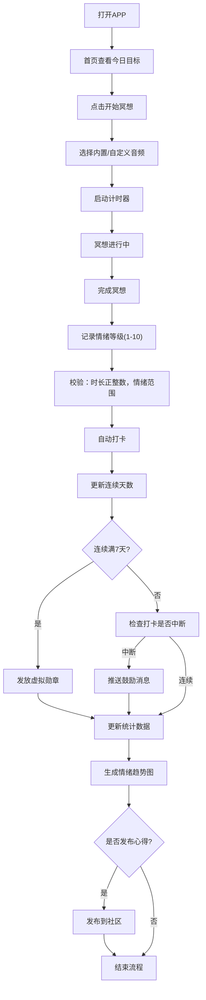
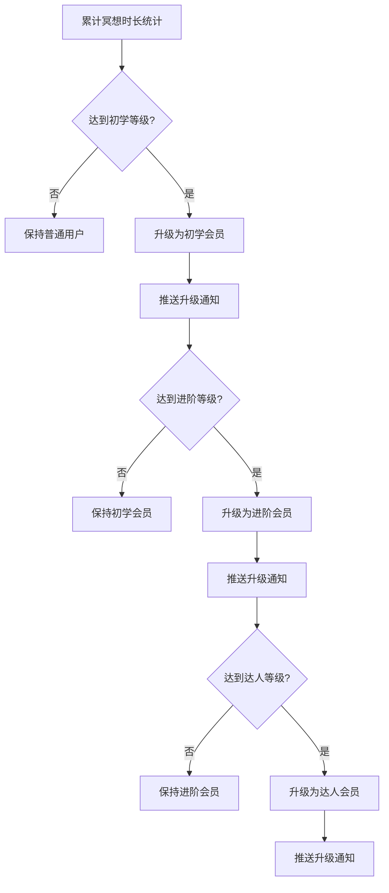

## 1. 产品概述

个人冥想与正念练习APP，围绕用户日常心理健康与习惯养成场景设计，帮助用户建立规律的冥想习惯，改善情绪状态，提升生活质量。

- 核心价值：通过智能推荐、数据追踪、社区互动三大维度，降低用户冥想门槛，提高长期坚持意愿
- 目标用户：关注心理健康、希望缓解压力、养成正念习惯的都市人群

## 2. 核心功能

### 2.1 用户角色

| 角色 | 注册方式 | 核心权限 |
|------|----------|----------|
| 普通用户 | 应用内注册 | 创建冥想计划、使用计时器、记录情绪、查看报告、社区互动 |
| 会员用户 | 累计冥想时长升级 | 解锁高级课程、专属勋章、完整报告导出 |

### 2.2 功能模块

1. **首页仪表盘**：今日冥想目标、连续打卡天数、快捷开始入口、情绪概览
2. **冥想计时器**：计时功能、内置/自定义音频播放、完成后情绪记录
3. **冥想计划**：创建计划、设定目标时长、智能推荐时长、历史完成率
4. **数据统计**：情绪变化趋势图、月度报告生成、PDF导出功能
5. **打卡与勋章**：连续打卡追踪、7天勋章奖励、中断鼓励推送
6. **会员中心**：会员等级展示、升级进度、权益说明
7. **社区广场**：发布练习心得、点赞评论、热度推荐首页展示

### 2.3 页面详情

| 页面名称 | 模块名称 | 功能描述 |
|----------|----------|----------|
| 首页仪表盘 | 数据概览卡片 | 展示今日目标完成度、连续打卡天数、今日推荐时长 |
| 首页仪表盘 | 快捷操作区 | 快速开始冥想、查看今日提醒、进入会员中心 |
| 冥想计时器 | 计时控制 | 开始/暂停/结束冥想，显示剩余时间 |
| 冥想计时器 | 音频选择 | 内置自然音效列表、自定义MP3上传（≤20MB） |
| 冥想计时器 | 情绪记录 | 完成后选择1-10情绪等级，必填校验 |
| 冥想计划 | 计划创建 | 设定每日目标时长（正整数校验）、开始日期 |
| 冥想计划 | 智能推荐 | 根据历史完成率动态调整每日推荐时长 |
| 数据统计 | 情绪趋势图 | 按周/月展示情绪变化曲线 |
| 数据统计 | 月度报告 | 汇总总时长、打卡率、情绪曲线、勋章成就 |
| 数据统计 | PDF导出 | 生成并下载月度报告PDF文件 |
| 打卡与勋章 | 打卡日历 | 展示每日打卡状态、连续天数 |
| 打卡与勋章 | 勋章墙 | 展示已获得和待解锁的虚拟勋章 |
| 会员中心 | 等级进度 | 累计冥想总时长、当前等级、下一等级进度 |
| 会员中心 | 权益展示 | 初学/进阶/达人三档会员权益说明 |
| 社区广场 | 心得列表 | 按热度排序展示用户练习心得 |
| 社区广场 | 发布功能 | 发布文字心得、关联冥想记录 |
| 社区广场 | 互动功能 | 点赞、评论、热度计算推荐 |

## 3. 核心流程

### 3.1 主要用户流程

用户打开APP → 首页查看今日目标 → 点击开始冥想 → 选择音频 → 启动计时器 → 完成冥想 → 记录情绪等级 → 自动打卡 → 查看统计数据 → 可选择发布心得到社区

### 3.2 会员升级流程

## 4. 用户界面设计

### 4.1 设计风格

- **主色调**：深紫色渐变 (#6366f1 → #8b5cf6) 代表宁静与冥想，辅以柔和的薄荷绿 (#34d399) 作为积极情绪的点缀
- **辅助色**：柔和的珊瑚粉 (#f87171) 用于警告提示，暖橙色 (#fbbf24) 用于勋章和成就
- **背景**：深色主题，深靛蓝渐变背景 (#0f172a → #1e1b4b) 营造沉浸式冥想氛围
- **按钮风格**：圆角胶囊按钮，带有柔和的发光效果，点击时有轻微的缩放动画
- **字体**：显示字体使用 "Playfair Display"（优雅衬线体），正文字体使用 "Noto Sans SC"（清晰易读的无衬线体）
- **布局风格**：卡片式设计，毛玻璃效果 (backdrop-filter) 营造层次感，大量留白营造宁静感
- **图标风格**：线性简约图标，统一使用圆角风格，配合微妙的发光效果
- **动画风格**：呼吸灯效果、缓慢的渐入动画、柔和的过渡效果，避免快速刺眼的动画

### 4.2 页面设计概览

| 页面名称 | 模块名称 | UI元素 |
|----------|----------|--------|
| 首页仪表盘 | 数据概览卡片 | 渐变背景、毛玻璃效果、呼吸动画、大数字展示 |
| 首页仪表盘 | 快捷操作区 | 圆形悬浮按钮、发光效果、hover放大动画 |
| 冥想计时器 | 计时显示 | 巨大的圆形倒计时、呼吸灯效果、脉冲动画 |
| 冥想计时器 | 音频选择 | 横向滚动卡片、选中态发光边框、播放状态指示 |
| 冥想计时器 | 情绪记录 | 10个渐变圆形按钮、选中放大效果、表情图标辅助 |
| 数据统计 | 情绪趋势图 | 柔和曲线、渐变填充区域、悬停数据点提示 |
| 打卡与勋章 | 打卡日历 | 圆形日期格子、完成态渐变填充、连续日期连线 |
| 打卡与勋章 | 勋章墙 | 3D悬浮卡片、已获得发光效果、未获得灰度显示 |
| 会员中心 | 等级进度 | 进度条渐变、里程碑标记、数字滚动动画 |
| 社区广场 | 心得卡片 | 瀑布流布局、用户头像、点赞评论数、热度标记 |

### 4.3 响应式设计

- 采用桌面优先设计，适配平板和移动端
- 移动端：单列布局，底部导航栏，触控区域放大到48x48px
- 平板端：两列网格布局，侧边导航栏
- 桌面端：三列网格布局，固定侧边栏，充分利用大屏空间
- 所有交互元素支持触控操作，滑动手势翻页

### 4.4 视觉特效

- **背景**：微妙的渐变网格纹理、缓慢飘动的星云粒子效果
- **卡片**：悬浮时轻微上浮 + 阴影增强 + 边框发光
- **计时器**：圆形进度条配合呼吸灯效果，模拟冥想时的呼吸节奏
- **页面切换**：淡入淡出 + 轻微缩放的转场效果
- **勋章获得**：金色粒子爆炸特效 + 缓慢旋转展示
