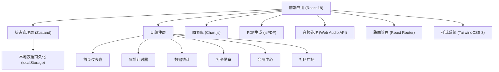
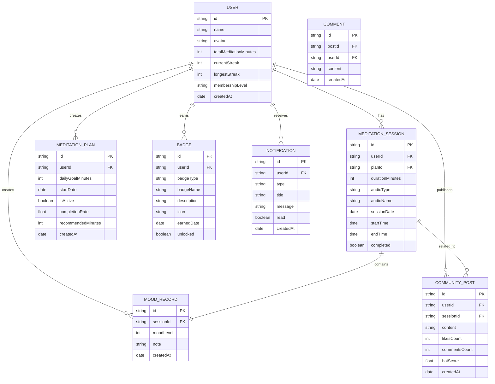

## 1. 架构设计



## 2. 技术描述

- **前端框架**：React@18.2.0 + TypeScript@5.0.0
- **构建工具**：Vite@5.0.0
- **状态管理**：Zustand@4.4.0（轻量型状态管理，适合中小型应用）
- **路由管理**：React Router DOM@6.20.0
- **样式方案**：TailwindCSS@3.3.0 + CSS Variables
- **图表库**：Chart.js@4.4.0 + react-chartjs-2@5.2.0
- **PDF导出**：jsPDF@2.5.0 + jspdf-autotable@3.5.0
- **图标库**：Lucide React@0.290.0
- **动画库**：Framer Motion@10.16.0
- **数据持久化**：localStorage + 自定义hooks封装
- **音频处理**：原生HTML5 Audio API + Web Audio API
- **Mock数据**：预置示例数据，无需后端服务

## 3. 路由定义

| 路由路径 | 页面名称 | 核心功能 |
|----------|----------|----------|
| / | 首页仪表盘 | 数据概览、快捷开始、今日目标 |
| /meditation | 冥想计时器 | 计时控制、音频选择、情绪记录 |
| /plan | 冥想计划 | 创建计划、智能推荐、历史记录 |
| /statistics | 数据统计 | 情绪趋势图、月度报告、PDF导出 |
| /badges | 打卡勋章 | 打卡日历、勋章墙、连续天数 |
| /membership | 会员中心 | 等级进度、权益展示、升级通知 |
| /community | 社区广场 | 心得列表、发布功能、互动功能 |

## 4. 数据模型

### 4.1 数据模型定义



### 4.2 核心数据结构定义

```typescript
// 用户信息
interface User {
  id: string;
  name: string;
  avatar: string;
  totalMeditationMinutes: number;
  currentStreak: number;
  longestStreak: number;
  membershipLevel: '普通用户' | '初学' | '进阶' | '达人';
  createdAt: string;
}

// 冥想计划
interface MeditationPlan {
  id: string;
  userId: string;
  dailyGoalMinutes: number;
  startDate: string;
  isActive: boolean;
  completionRate: number;
  recommendedMinutes: number;
  createdAt: string;
}

// 冥想记录
interface MeditationSession {
  id: string;
  userId: string;
  planId: string;
  durationMinutes: number;
  audioType: 'built-in' | 'custom';
  audioName: string;
  audioUrl?: string;
  sessionDate: string;
  startTime: string;
  endTime: string;
  completed: boolean;
  moodLevel?: number;
}

// 勋章
interface Badge {
  id: string;
  userId: string;
  badgeType: 'streak_7' | 'streak_30' | 'total_100' | 'total_500' | 'first_meditation';
  badgeName: string;
  description: string;
  icon: string;
  earnedDate?: string;
  unlocked: boolean;
}

// 社区帖子
interface CommunityPost {
  id: string;
  userId: string;
  userName: string;
  userAvatar: string;
  sessionId?: string;
  content: string;
  likesCount: number;
  commentsCount: number;
  hotScore: number;
  liked: boolean;
  createdAt: string;
  comments: Comment[];
}

// 会员等级配置
interface MembershipLevel {
  level: string;
  name: string;
  requiredMinutes: number;
  benefits: string[];
  color: string;
}

// 月度报告
interface MonthlyReport {
  year: number;
  month: number;
  totalMinutes: number;
  totalSessions: number;
  checkInRate: number;
  averageMood: number;
  moodTrend: { date: string; mood: number }[];
  badgesEarned: Badge[];
  dailyBreakdown: { date: string; minutes: number }[];
}
```

## 5. 状态管理设计

### 5.1 Store 分层设计

```typescript
// useUserStore - 用户相关状态
- user: User | null
- updateUser: (data: Partial<User>) => void
- calculateMembershipLevel: () => void
- checkStreakContinuity: () => void

// useMeditationStore - 冥想相关状态
- currentSession: MeditationSession | null
- sessions: MeditationSession[]
- plans: MeditationPlan[]
- startSession: (duration: number, audio: AudioConfig) => void
- endSession: (moodLevel: number) => void
- createPlan: (dailyGoal: number) => void
- calculateRecommendedMinutes: () => number

// useBadgeStore - 勋章相关状态
- badges: Badge[]
- checkBadgeUnlock: () => void
- unlockBadge: (badgeType: string) => void

// useCommunityStore - 社区相关状态
- posts: CommunityPost[]
- addPost: (content: string, sessionId?: string) => void
- likePost: (postId: string) => void
- addComment: (postId: string, content: string) => void
- calculateHotScore: () => void

// useNotificationStore - 通知相关状态
- notifications: Notification[]
- addNotification: (type: string, title: string, message: string) => void
- markAsRead: (id: string) => void
```

## 6. 核心工具函数

### 6.1 智能推荐算法
```typescript
function calculateRecommendedMinutes(
  dailyGoal: number,
  completionRate: number,
  currentStreak: number
): number {
  // 基础推荐 = 目标时长 * 完成率系数
  let base = dailyGoal;
  
  // 根据完成率调整
  if (completionRate >= 0.9) {
    base = Math.floor(dailyGoal * 1.2); // 超额完成，增加20%
  } else if (completionRate >= 0.7) {
    base = dailyGoal; // 正常完成，保持目标
  } else if (completionRate >= 0.5) {
    base = Math.floor(dailyGoal * 0.8); // 部分完成，减少20%
  } else {
    base = Math.floor(dailyGoal * 0.5); // 低完成率，减少50%
  }
  
  // 连续打卡加成
  if (currentStreak >= 7) {
    base = Math.floor(base * 1.1);
  }
  
  return Math.max(5, base); // 最少5分钟
}
```

### 6.2 热度计算算法
```typescript
function calculateHotScore(
  likes: number,
  comments: number,
  createdAt: Date
): number {
  const hoursAgo = (Date.now() - createdAt.getTime()) / (1000 * 60 * 60);
  const gravity = 1.8;
  
  return (likes * 2 + comments * 3) / Math.pow(hoursAgo + 2, gravity);
}
```

### 6.3 会员等级计算
```typescript
function getMembershipLevel(totalMinutes: number): MembershipLevel {
  if (totalMinutes >= 5000) {
    return { level: '达人', requiredMinutes: 5000, color: '#fbbf24' };
  } else if (totalMinutes >= 1000) {
    return { level: '进阶', requiredMinutes: 1000, color: '#8b5cf6' };
  } else if (totalMinutes >= 300) {
    return { level: '初学', requiredMinutes: 300, color: '#34d399' };
  }
  return { level: '普通用户', requiredMinutes: 0, color: '#64748b' };
}
```

### 6.4 表单校验规则
```typescript
// 时长校验
function validateDuration(minutes: number): { valid: boolean; message?: string } {
  if (minutes === undefined || minutes === null) {
    return { valid: false, message: '时长为必填项' };
  }
  if (!Number.isInteger(minutes)) {
    return { valid: false, message: '时长必须为整数' };
  }
  if (minutes <= 0) {
    return { valid: false, message: '时长必须为正整数' };
  }
  return { valid: true };
}

// 情绪等级校验
function validateMoodLevel(level: number): { valid: boolean; message?: string } {
  if (level === undefined || level === null) {
    return { valid: false, message: '请选择情绪等级' };
  }
  if (!Number.isInteger(level) || level < 1 || level > 10) {
    return { valid: false, message: '情绪等级必须为1-10之间的整数' };
  }
  return { valid: true };
}

// 音频文件校验
function validateAudioFile(file: File): { valid: boolean; message?: string } {
  const maxSize = 20 * 1024 * 1024; // 20MB
  if (file.type !== 'audio/mpeg' && file.type !== 'audio/mp3') {
    return { valid: false, message: '仅支持MP3格式音频' };
  }
  if (file.size > maxSize) {
    return { valid: false, message: '音频文件大小不能超过20MB' };
  }
  return { valid: true };
}
```

## 7. 项目目录结构

```
src/
├── assets/                 # 静态资源
│   ├── audios/            # 内置冥想音频
│   ├── images/            # 图片资源
│   └── fonts/             # 自定义字体
├── components/            # 公共组件
│   ├── layout/            # 布局组件
│   ├── ui/                # 基础UI组件
│   └── features/          # 业务组件
├── hooks/                 # 自定义Hooks
│   ├── useTimer.ts        # 计时器Hook
│   ├── useAudio.ts        # 音频播放Hook
│   └── useLocalStorage.ts # 本地存储Hook
├── store/                 # 状态管理
│   ├── useUserStore.ts
│   ├── useMeditationStore.ts
│   ├── useBadgeStore.ts
│   ├── useCommunityStore.ts
│   └── useNotificationStore.ts
├── pages/                 # 页面组件
│   ├── Dashboard/
│   ├── Meditation/
│   ├── Plan/
│   ├── Statistics/
│   ├── Badges/
│   ├── Membership/
│   └── Community/
├── types/                 # TypeScript类型定义
│   └── index.ts
├── utils/                 # 工具函数
│   ├── calculations.ts    # 计算工具
│   ├── validators.ts      # 校验工具
│   ├── pdfGenerator.ts    # PDF生成
│   └── mockData.ts        # Mock数据
├── App.tsx                # 根组件
├── main.tsx               # 入口文件
└── index.css              # 全局样式
```
